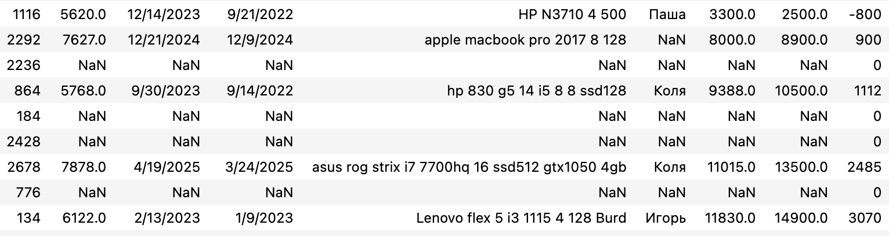
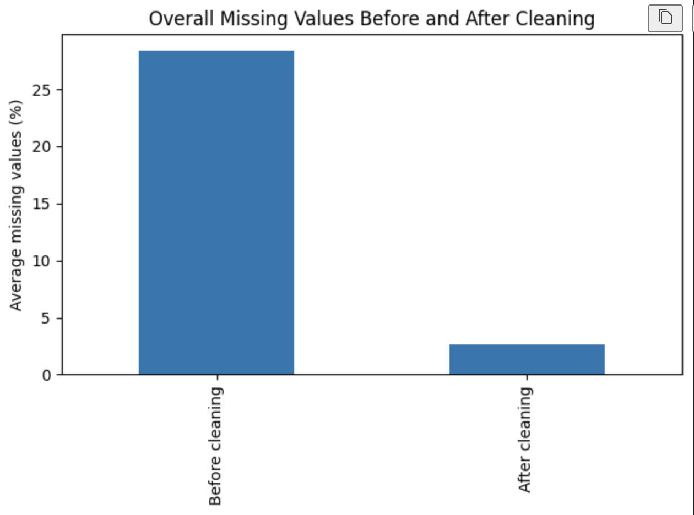
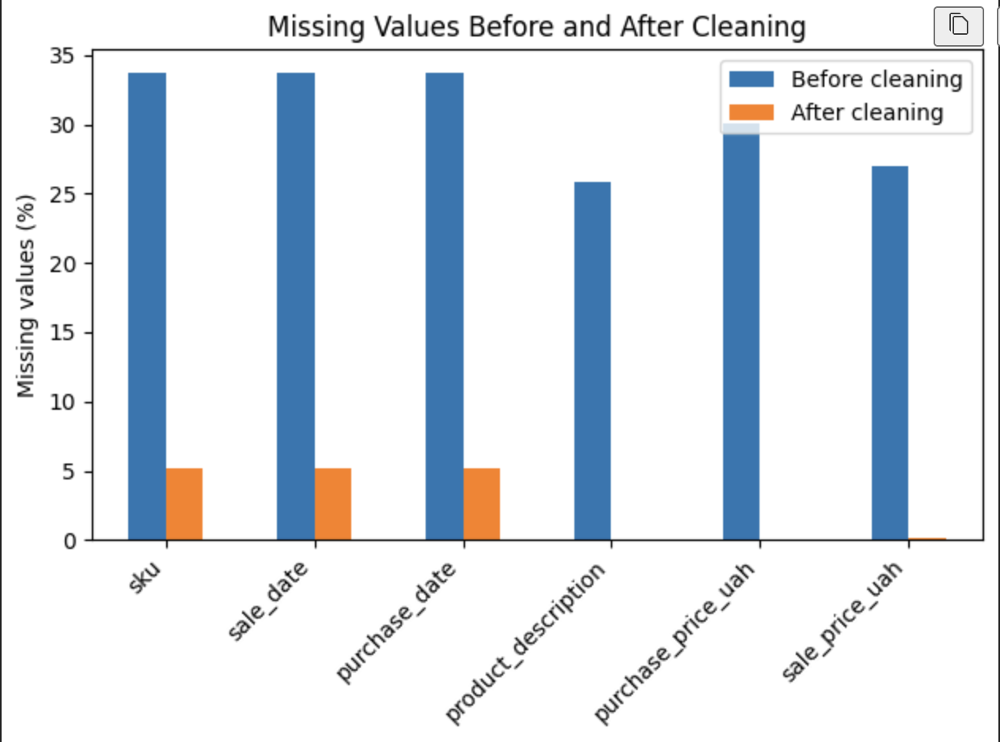
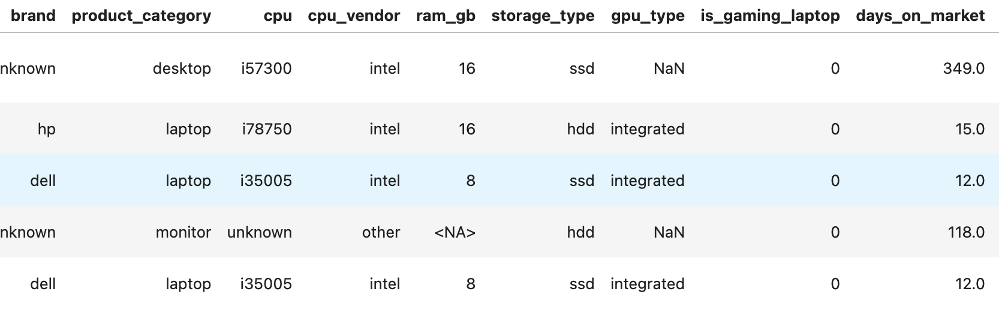
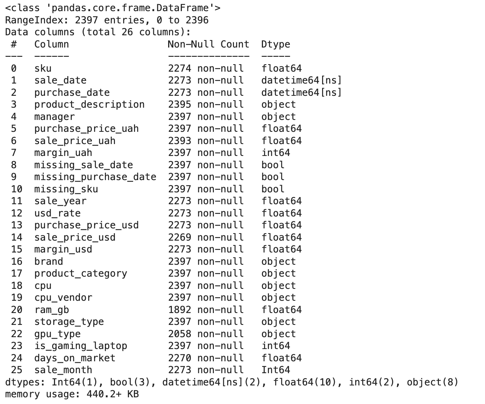

# Real-World Sales Data Cleaning

This case shows how messy real-world sales data was cleaned, normalized,
and prepared for reliable analysis and reporting.
 
---

## Dataset Overview

- Time period: 2023–2025  
- Primary product category: laptops  
- Additional records: accessories, refunds, miscellaneous operations  
- Currency: UAH (with derived USD values)

---

## The Problem

The raw dataset contained multiple data quality issues typical for small
retail businesses working with manual spreadsheets and batch exports:

- Structural empty rows caused by batch-based data extraction
- Mixed record types (sales, accessories, refunds) stored in a single table
- Missing identifiers and dates in sales records
- Dates stored as strings with inconsistent formats
- Free-text product descriptions with inconsistent naming
- Incomplete records not consistently populated

### Raw Data Snapshot
Unstructured CSV with unnamed columns, missing values, and mixed record types.

### Missing Values Audit
Key fields were partially populated and required explicit handling.

## Data Cleaning Workflow

The cleaning process follows a clear, step-by-step set of data preparation steps:

1. **Initial data audit**  
   - Identification of structural empty rows  
   - Analysis of partially filled records  

2. **Removal of structural artifacts**  
   - Rows introduced by batch-based extraction  

3. **Separation of non-sales operational records**  
   - Accessories, refunds, miscellaneous transactions  

4. **Handling incomplete sales records**  
   - Retained with explicit missing-value flags  

5. **Date standardization**  
   - Conversion to datetime without fabricating values  

6. **Categorical and text normalization**  
   - Standardized manager field  
   - Basic normalization of product descriptions  

7. **Currency feature creation**  
   - Year-based USD conversion while preserving original UAH values  

---

## Output Datasets

- `sales_clean.csv` — cleaned laptop sales data, ready for analysis, reporting, or automation

- `other_operations.csv` — non-sales operational records separated for independent analysis  

---

## Notes

- Missing values are handled explicitly using boolean flags.
- No synthetic or fabricated data is introduced.
- The notebook is fully reproducible using **Restart & Run All**.

---

## Optional Data Enrichment (Within Data Preparation Scope)

In addition to cleaning, selected unstructured fields were normalized
into structured columns to make the dataset usable for analysis,
reporting, and downstream automation.

**Structured product attributes extracted from free-text descriptions**

**Final enriched schema after normalization**

### Hardware Feature Extraction
- CPU information was parsed and normalized into high-level vendors (Intel, AMD, Apple), including support for abbreviated and legacy processor names.
- RAM size was extracted using conservative, rule-based logic to minimize false positives from noisy listings.
- Storage configuration was inferred based on SSD/HDD indicators, with hybrid setups explicitly identified.
- GPU type was derived using lightweight keyword detection, distinguishing discrete graphics from integrated solutions.

### Category Refinement
- Products initially labeled as `other` were re-evaluated using hardware signals (CPU and RAM) to identify additional laptop entries.
- This step reduced category ambiguity while avoiding aggressive or speculative reclassification.

### Gaming Laptop Identification
- GPU parsing and gaming classification were applied exclusively to laptop entries to prevent feature leakage across device types.
- A binary `is_gaming_laptop` flag was introduced based on the presence of discrete GPUs (GTX, RTX, Radeon).

### Temporal Features
- Time-to-sale (`days_on_market`) was calculated as the difference between purchase and sale dates to capture product liquidity.
- Sale month was extracted to support seasonality analysis.

---

## Result

- Clean and consistently structured sales dataset
- Explicit handling of missing values without fabrication
- Non-sales records separated for independent use
- Dataset ready for reporting, analysis, or automation

## Business Context

The dataset represents real-world sales data from a small retail business specializing in refurbished (used) laptops.  
Products are acquired through buyback channels, refurbished, and resold via local marketplaces, resulting in heterogeneous product conditions, pricing, and sales dynamics.

This context explains the presence of noisy descriptions, wide price dispersion, and long-tailed sales durations observed throughout the analysis.

